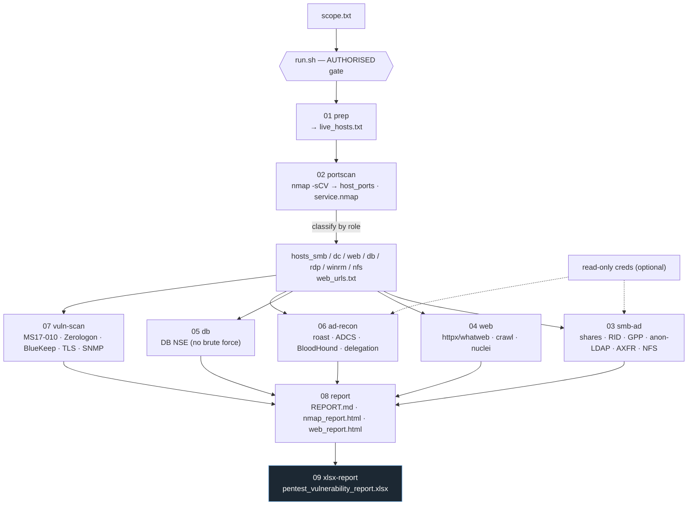
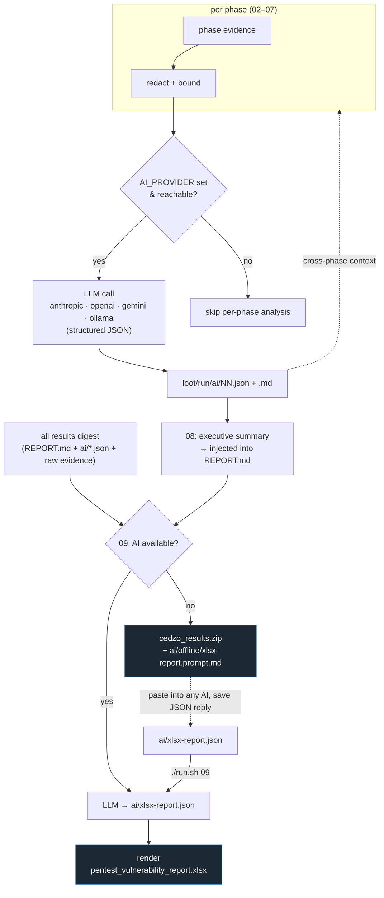

# CEDZO — Flowchart

Visual overview of the recon pipeline and the AI augmentation layer.
(Diagrams use [Mermaid](https://mermaid.js.org/); they render on GitHub.)

## 1. Recon pipeline

> Recon-only: every phase **reads** scope-derived host lists and **writes**
> evidence files; nothing is exploited. Runs resume via `.done-NN` markers.

## 2. AI augmentation layer

### Notes

- **Phase 04 feedback:** the web AI maps the detected tech stack to nuclei tags
  and runs an *additive* `nuclei_ai.txt` pass — it never replaces the broad scan.
- **Compounding:** phases 04–07 feed earlier `ai/*.json` back in, so analysis
  builds up; 08–09 synthesise across everything.
- **Privacy:** evidence is redacted + bounded before any send; raw hashes and the
  secrets report are never sent. No provider authorised? Use the offline path
  (zip + prompt pack) or `AI_PROVIDER=ollama` (fully local).
