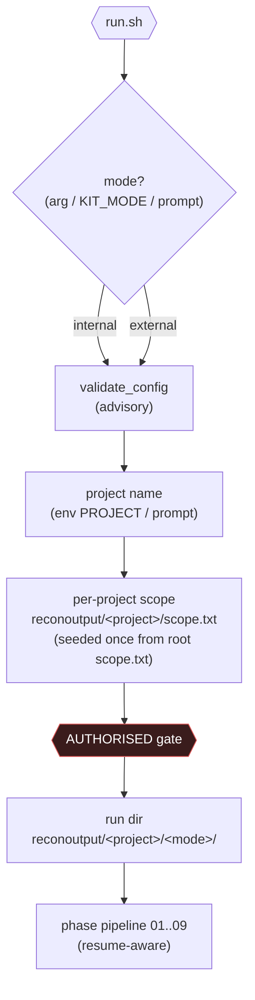
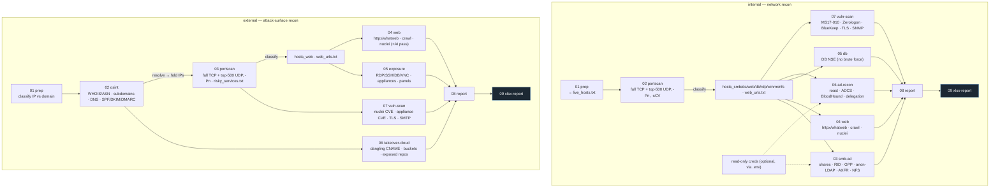
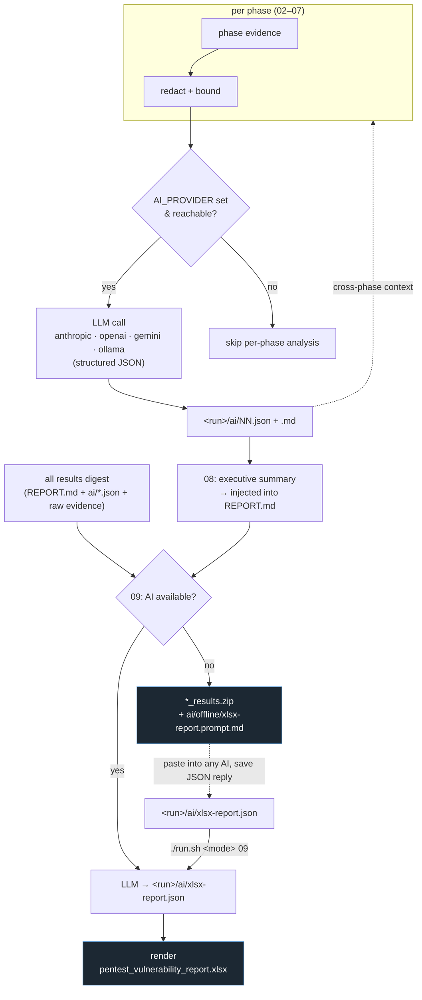

# CEDZO — Flowchart

Visual overview of the two-mode recon pipeline and the AI augmentation layer.
(Diagrams use [Mermaid](https://mermaid.js.org/); they render on GitHub.)

## 1. Launch, mode & project

> **Resume.** A phase that finishes drops `.done-NN`; each sub-task drops
> `.tasks/NN-<id>.done`. Re-running the **same project** skips finished phases,
> and within a partially-done phase resumes at the first unfinished sub-task. A
> **new project name** starts fresh. Internal and external keep separate sub-dirs.

## 2. Recon pipelines (per mode)

> Recon-only: every phase **reads** scope-derived host lists and **writes**
> evidence files; nothing is exploited.

## 3. AI augmentation layer

`<run>` = `reconoutput/<project>/<mode>`.

### Notes

- **Phase 04 feedback:** the web AI curates the genuine target URLs (from the
  katana/dir-enum list) and stack tags, which feed nuclei; with no AI it falls
  back to the full consolidated list.
- **Compounding:** phases 04–07 feed earlier `ai/*.json` back in, so analysis
  builds up; 08–09 synthesise across everything.
- **Privacy:** evidence is redacted + bounded before any send; raw hashes and the
  secrets report are never sent. No provider authorised? Use the offline path
  (zip + prompt pack) or `AI_PROVIDER=ollama` (fully local).
